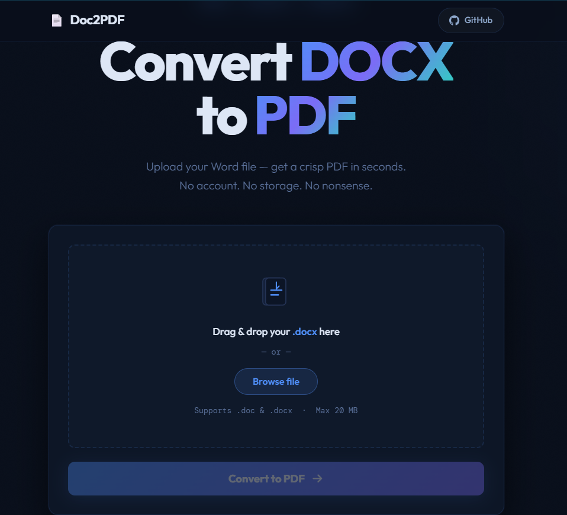

# 📄 doc2PDF

A clean, modern DOCX to PDF converter with drag & drop upload, real-time progress, and instant auto-download.

🌐 **[Live Demo](https://github.com/shawnazd/Doc2PDF)**

---

## 📸 Screenshot

---

## ✨ Features

- **Drag & drop upload** — Drop your file or click to browse
- **Auto-download** — PDF downloads automatically on success
- **Client-side validation** — Type checking and 20 MB size limit before upload
- **Animated progress bar** — Real-time percentage updates during conversion
- **Privacy-first** — Files are never stored; processed and deleted instantly
- **Fully responsive** — Works great on mobile and desktop

---

## 🛠 Built With

- HTML5, CSS3, JavaScript (ES6+)
- [Outfit](https://fonts.google.com/specimen/Outfit) — Google Fonts
- [doc-to-pdf-backend.onrender.com](https://doc-to-pdf-backend.onrender.com) — Conversion API
- [open.er-api.com](https://open.er-api.com) — _(backend powered by LibreOffice)_

---

## 👤 Developers

**Al Addin** · [GitHub](https://github.com/addin-alt) · [Facebook](https://facebook.com/addin-alt)

**Shawn** · [GitHub](https://github.com/shawnazd) · [Facebook](https://facebook.com/shawnazd)
